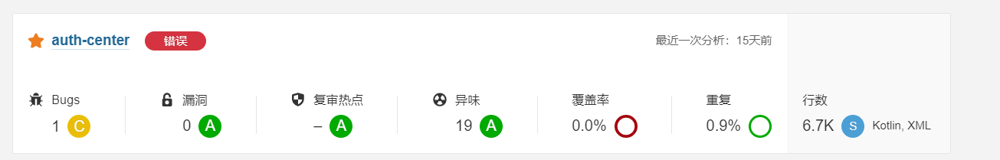

## 前言

为了保证开发风格和质量，实现较好的可读性和可维护性。推行以下前端开发基础规范，规范按照强制、推荐和一般自适应三个等级去要求和执行。条目中未强调的均为强制要求项，后续在规范推进和传播过程中，集合大家的力量和项目特性丰富和细化规范标准。  
并且要求落实和执行，后续会随着实施阶段进行监督和跟踪。目的是为了各自前端项目和团队能够更轻松和专注在业务上，挖掘更有挑战的东西，减少重复和差异的基础开发共识问题。

## 总览

前端开发在编写公司项目代码的原则和思路：

- 符合 web 标准（UTF-8，HTML5）。
- 语义化 html（HTML5 语义化标签，相对减少 div 和 span 等无特定语义的标签使用）。
- 结构表现行为分离（HTML-CSS-JS 代码分离，不同行为代码分离，做到高内聚低耦合）。
- 网站呈现效果要保持多主流浏览器 UI 展示一致，移动端和 PC 端设备兼容无错乱。
- 浏览器兼容要求满足 chrome，firefox,Edge 等主流或相同内核的浏览器。对于已存在的 vue2 项目兼容到 ie11 及以上。
- 页面性能方面（减少无意义的请求次数，例如使用精灵图和预编译 css 语法）。
- 代码要求简洁明了有序，尽可能的减小服务器负载，保证最快的解析速度（减小 repaint 和 reflow）。
- 代码需要清晰和规范的命名，这对于了解快速熟悉一个项目是必要的。
- 对代码进行注释对于提高可读性有帮助，需要在业务逻辑和公共方法里面把条件和逻辑都详细备注好，在功能迭代和调整后也需要在代码片段相应增加注释。

## 文件命名规范

- 所有文件夹及文件使用英文命名。避免使用中文路径，使用中划线命名风格。
- 项目命名，中划线方式的英文命名，且框架项目 package 里面的 name 应和项目名保持一致。
- 前端资源按 html，css，js，img，font 基础类别分类，对应文件均存放至项目的对应文件名目录中。如果使用相关前端框架，根据框架的文件格式进行合理布局。
- html 文件：入口文件使用 index.html。每个频道和栏目按照英文称呼原则酌情做到清晰命名。

```
// 推荐命名
|- index.html // 首页
|- list.html // 列表页
|- detail.html // 详情页
|- /components // 分类频道文件夹/公共组件文件夹
  |-filter.html // 筛选器页面/模块
  |-form.html // 表单页面/模块
  |-operate-box.html // 操作栏页面/模块或者更细的颗粒单元组件等等
  ...
```

- css 文件命名：后缀.css（预编译工具使用 less）。首页或唯一的 css 文件 index.css，其他页面按照对应的 html 命名。

```
// 推荐命名（以less举例）
|- index.less
|- variable.less // 全局变量单元
|- initialize.less // 初始化通用规则（标签，行高，重置属性等等）
|- base.less // 基础样式单元
|- element-ui.less // 复写ui库的样式单元（以elementUi为例）
|- tab-bar.less // 详细的公用样式单元等等
...
```

- JS 文件命名：后缀.js。唯一或者主要的用 index.js，其他页面按照对应的 html 命名。由于 JS 文件在前端框架业务中也会分散在单元模块里，独立的 JS 文件目录会相对更简洁一些。

```
// 推荐命名
|- index.js // 唯一或者主JS
|- common.js // 统一调用的公共方法集合
|- validate.js // 独立完整的功能单元JS（以验证功能为例）
...
```

- img 和 iconfont 相关资源类文件命名：与命名规范主思路保持一致即可。

```
// 推荐命名
|- /img
  |- banner.png
  |- hot-icon-01.jpg
|- /iconfont
  |- iconfont.ttf
```

## 代码检测标准

我们使用 sonar 作为代码质量的检查工具，要求代码的 bug 和漏洞不能大于 0，代码重复率不能大于 3%。  

[Sonar 中文官网](http://www.sonar.org.cn/)

## 分类详细基础规则

### HTML 规范

- 文档类型声明及编码：统一为 HTML5 声明类型标准。书写时利用 IDE 实现层次分明的缩进（默认缩进 2 空格）。
- 指定页面编码为 utf-8，减少 ASCII 码出现的中文乱码情况。
- 根据 HTML 元素的语义使用相关元素。
- 非特殊情况下 CSS 文件放在 body 部分\<head\>标签后。非特殊情况下大部分 JS 文件放在\<body\>标签尾部（如果需要界面未加载前执行的代码可以放在 head 标签后）避免行内 JS 和 CSS 代码。
- 所有编码需要遵循 html（XML）标准，标签&属性&属性命名必须由小写字母及中划线数字组成，且所有标签必须闭合，包括 br()，hr()等。属性值用双引号。
- 需要为 html 元素添加自定义属性的时候，首先要考虑下有没有默认的已有的合适标签去设置，如果没有，可以使用须以"data-"为前缀来添加自定义属性，避免使用"data："等其他混乱命名方式。
- 语义化 html，如标题根据重要性用 h\*(同一页面只能有一个 h1)，段落标记用 p，列表用 ul，内联元素中不可嵌套块级元素。
- 尽可能减少不必要的 div 多层级嵌套，节点的优化是必要的。
- 书写链接地址时，必须避免重定向，例如：href="`http://myVue.com/`"，即须在 URL 地址后面加上“/”。
- 添加合理的注释，说明相关代码是做什么的，只在关键代码处添加相关注释，避免过多添加增加 HTML 和 CSS 的代码量。
- 使用 TODO 注释，说明代码功能。

---

### Vue 框架规范

- 版本要求：Vue 版本不低于 3.2。构建工具 Vite 版本不低于 2.9。状态管理工具 Pinia 版本不低于 2.0。UI 库推荐 Element Plus，和大部分已有项目的 elementUi 升级相对平滑，版本尽可能使用最新版本。

---

### CSS 规范

- 协作开发及分工：项目主负责人会根据各个模块，同时根据页面相似程序，事先写框架文件，分配给前端人员实现内部结构&表现&行为。共用 css 文件由主负责人书写，协作开发过程中，每个页面请务必都要引入。此文件包含 reset 默认样式、初始化样式及公共头部底部样式，此文件不可随意修改。
- class 与 id 的使用：id 是唯一的并是父级的，class 是可以重复的并是子级的，所以 id 仅使用在主模块或者需要调用的 dom 上，class 可用在重复使用率高及子级中。另一部分 id 命名为 JS 预留钩子的，开发过程中开发人员自行添加。
- 为 JS 预留钩子的命名，请以 j\-起始，比如：j-hide，j-show。
- class 与 id 命名：大的框架命名比如 header/footer/wrapper/left/right 之类的在项目中由主负责人统一命名。其他样式名称由小写英文、中划线、数字来组合命名，如 i-comment，fontred，w200。尽量避免使用中文拼音，使用简易的单词组合。总之，命名要语义化，简明化。另附一份参考命名表
- css 属性书写顺序，建议遵循：布局定位属性-->自身属性-->文本属性-->其他属性.此条可根据自身习惯书写，但尽量保证同类属性写在一起.属性列举：
  > - 布局定位属性主要包括：display&list-style&position（相应的 top，right，bottom，left）＆float&clear＆visibility＆overflow；
  > - 自身属性主要包括：width&height&margin&padding&border&background。
  > - 文本属性主要包括：color&font&text-decoration&text-align&vertical-align&white-space
  > - 其他&content。
- 书写代码前，合理规划提高样式重复使用率。
- 充分利用 html 自身属性及样式继承原理减少代码量。
- 背景图片请尽可能使用精灵图技术，减小 http 请求，考虑到多人协作开发，精灵图按模块制作。
- 基于新技术和移动端的业务，可以使用 iconfont 和 svg 来替代一些纯色图片，实现更灵活弹性的效果。
- 用 png 图片做图片时，原则上要求图片格式为 png8 格式，若 png8 实在影响图片质量或其中有半透明效果，再使用 png24，目的是尽可能的减少图片的体积。
- 推荐相对的减少使用影响性能的属性，比如 position，float。
- 必须为大区块样式添加注释，小区块适量注释。
- 代码缩进与格式：建议一行一个属性书写，方便注释调试效果。
- 在页面中尽量避免使用 style 属性，即 style="…"。
- 能以背景形式呈现的图片，尽量写入 css 样式中。

[更多详情规则和建议指南](./css.md)

---

### JS 书写规范

基础约定

- 书写过程过，每行代码结束必须有分号。
- 库引入：原则上仅引入共识的 JS 库，如 jQuery 库，若需引入第三方库，须与团队其他人员讨论决定。
- 变量命名：驼峰式命名.原生 JS 变量要求是纯英文字母，首字母须小写，如 myVue。另要求变量集中声明，避免全局变量。
- 类命名：首字母大写，驼峰式命名.如 MyVue。
- 函数命名：首字母小写驼峰式命名.如 myVue()。
- 命名语义化，尽可能利用英文单词或其缩写。
- 尽量避免使用存在兼容性及消耗资源的方法或属性，比如 eval_r()&innerText。
- 代码结构明了，加适量注释。注意提高函数重用率。
- 注重与 html 分离，减小 reflow，注重浏览器性能。

[更多详情规则和建议指南](./js.md)

---

### 图片/iconfont 规范

- 所有页面元素类图片均放入 img 文件夹，测试用图片放于 demo 或其他具有明确描述的文件夹中，以备上线后清理冗余静态资源。
- 图片格式 gif/png/jpg。提倡使用 webp 文件格式，有条件使用软件进行图片压缩。
- 命名全部用小写英文字母||数字||-的组合；尽量用易懂的词汇，便于团队其他成员理解。
- 在保证视觉效果的情况下选择最小的图片格式与图片质量，以减少加载时间。单个图片文件大小控制在 80kb 以下。
- 运用 css sprite 技术集中小的背景图或图标，减小页面 http 请求，但注意，请务必在对应的精灵图 psd 源图中划参考线，并保存至 img 目录下。
- base64 可以替代一些小图片，同样也可以起到减少请求的作用。体积过大的不建议使用。
- 重要图片必须加上 alt 属性。给重要的元素和截断的元素加上 title。
